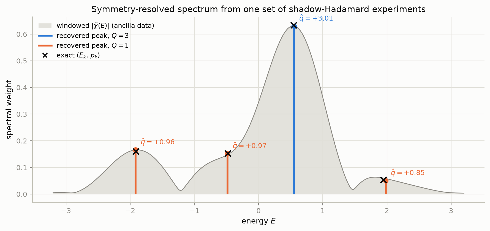
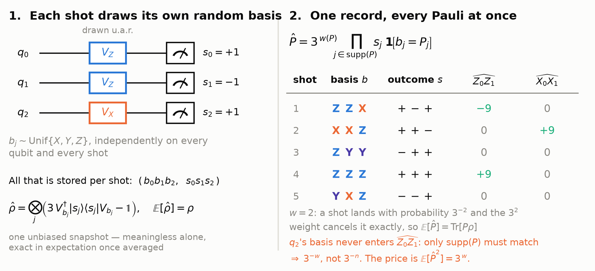
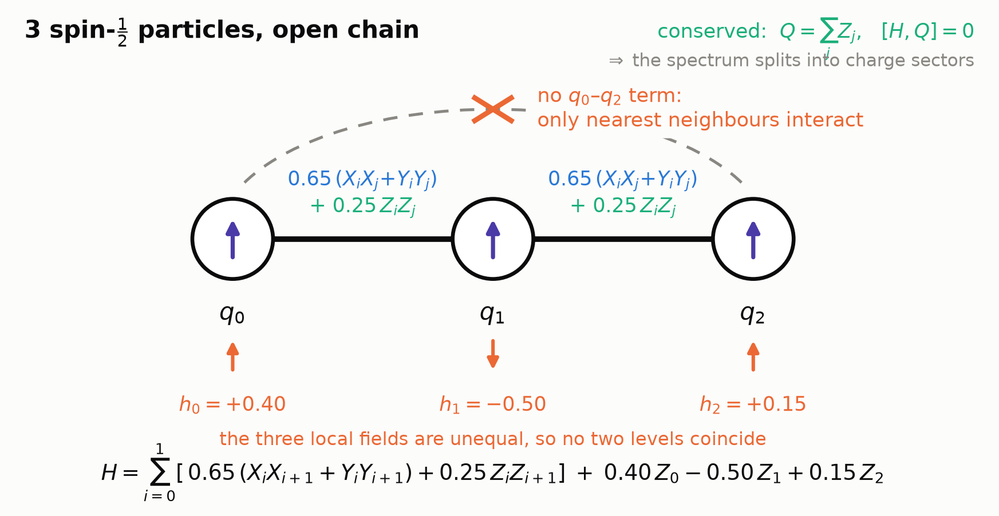
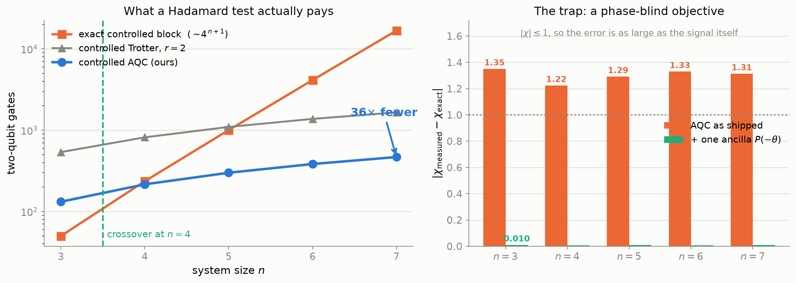
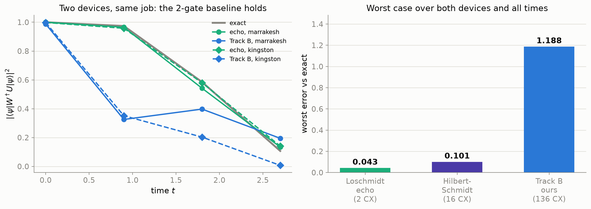

<!-- README design follows the conventions of large open-source projects
     (10k+ stars): centred hero + badge row + quick-nav as in
     huggingface/transformers and keras-team/keras; collapsible details and
     "docs as tables" as in pytorch/pytorch; reproducibility-first quickstart
     as in openai/whisper. All badges are static shields.io SVGs: no external
     service is queried about this repo. -->

<h1 align="center">Shadow-Enhanced Hadamard Test</h1>

<p align="center"><b>Team 8 — Garbage Collectors · Qiskit Hackathon 2026 · Topic 5</b></p>

<p align="center">
  
  
  
  
  
</p>

<p align="center">
  Every Hadamard test throws away half its data. <b>We recycle it.</b>
</p>

<p align="center">
  <a href="#5-minute-quickstart-reproduces-the-headline-numbers-from-saved-data">Quickstart</a> ·
  <a href="#headline-results">Results</a> ·
  <a href="#figure-gallery">Gallery</a> ·
  <a href="#whats-here">Repo map</a> ·
  <a href="#reproducibility-and-honesty-commitments">Honesty</a> ·
  <a href="deck/slides.pdf">Slides</a>
</p>

---

A standard Hadamard test measures one ancilla qubit and **throws the system register away**.
This project keeps it. By measuring those discarded qubits in randomly chosen bases they
become a *classical shadow*, so a single set of shots yields not just the interference
signal χ(t) but the system's observables and — the point of the whole exercise — a
**symmetry label for every recovered energy level**. We implement the protocol of
Faehrmann, Eisert & Kueng (PRL **135**, 150603, 2025) end to end on a 3-qubit XXZ benchmark,
validate every estimator against exact references, quantify what the extra information
costs, and characterise where the method breaks — on simulators and on three real IBM
devices.

**Every number in this repository traces to the command that produced it** (see
[`RESULTS.md`](RESULTS.md) and [`EVIDENCE.md`](EVIDENCE.md)). That includes the numbers we
got wrong and retracted.

<p align="center">
  
</p>
<p align="center"><i>The deliverable in one picture: every recovered energy level carries a
symmetry label extracted from the register everyone else throws away.</i></p>

<details>
<summary><b>The idea in one figure</b> — what a classical shadow actually is</summary>
<br>

The discarded register is measured in a random Pauli basis every shot. That randomisation is
the whole trick: it makes *one* record set an unbiased estimator for **every** Pauli
observable at once, instead of one chosen in advance.


</details>

<details>
<summary><b>The benchmark</b> — 3 spins, nearest-neighbour only, exactly solvable</summary>
<br>

A 3-site open XXZ chain — small enough to diagonalise exactly, so every estimate is graded
against truth, yet carrying both features the protocol exploits: a conserved charge and a
non-degenerate spectrum.


</details>

---

## 5-minute quickstart (reproduces the headline numbers from saved data)

No long reruns, no quantum hardware, no IBM account needed.

```bash
git clone <this-repo> && cd 2026
python -m venv .venv && source .venv/bin/activate
pip install "qiskit==2.5.1" "qiskit-aer==0.17.2" "numpy<2.5" "scipy<1.18" \
            matplotlib pylatexenc

# the headline result, read back from the saved 12-seed summary in data/
# (the per-seed CSVs behind it are also in data/; regenerate with evidence/scripts/seed_sweep.py)
python -c "
import json; d = json.load(open('data/multiseed_summary.json'))
print(f\"{'exact E':>9} {'recovered':>20} {'exact q':>8} {'recovered q':>16}  seeds OK\")
for r in d['rows']:
    print(f\"{r['E_exact']:+9.4f} {r['E_mean']:+11.4f} +- {r['E_sd']:.4f} \"
          f\"{r['q_exact']:+8d} {r['q_mean']:+11.3f} +- {r['q_sd']:.3f}  {r['labels_ok']}/{r['n_seeds']}\")
"
```

Expected output: four energy levels with across-seed sd 0.002-0.013 (max deviation from
exact 0.004), and **12/12 seeds label every level correctly**.

Then open [`figures/07_symmetry_resolved_spectrum.png`](figures/07_symmetry_resolved_spectrum.png)
— the money plot. Grey is the plain windowed Fourier transform of the ancilla signal; the
coloured stems are our reconstruction, coloured by the symmetry sector recovered from the
recycled data. (The grey blur is an *estimator* limitation, not a limitation of the standard
protocol — R021 shows the standard protocol with a good estimator recovers energies just as
well. What it cannot do, at any shot count, is produce the colour.)

**Full rerun** (~10 min, all 56 checkpoints, regenerates every figure):

```bash
pip install "ipykernel>=6.29,<7" nbconvert==7.17.1 nbclient==0.11.0
python -m ipykernel install --user --name qh26-t5
jupyter nbconvert --to notebook --execute --inplace \
  --ExecutePreprocessor.kernel_name=qh26-t5 shadow_hadamard_challenge_PARTICIPANT.ipynb
```

> **Environment note (real, cost us time):** `requirements.txt` pins `numpy==2.5.2` /
> `scipy==1.18.0`, which need **Python 3.12**. On 3.11 the install fails outright. The
> relaxed pins above are verified-good on 3.11 with all 56 checkpoints passing
> (logged as BUGLOG B01).

---

## Figure gallery

| figure | what it shows |
|---|---|
| [`07_symmetry_resolved_spectrum.png`](figures/07_symmetry_resolved_spectrum.png) | **Money plot** — recovered spectrum, colour = symmetry sector from the recycled register |
| [`06_fundamental_validation.png`](figures/06_fundamental_validation.png) | Four-panel validation: χ quadratures, joint observable, N^(−1/2) scaling |
| [`06_conservation.png`](figures/06_conservation.png) | Conserved ⟨Q⟩ flat in time vs non-conserved ⟨Z₀⟩ drifting — the pooling rule, shown |
| [`07_chi_vs_chiQ_spectra.png`](figures/07_chi_vs_chiQ_spectra.png) | χ vs χ_Q side by side — the ratio at each peak *is* the quantum number |
| [`09_noise_comparison.png`](figures/09_noise_comparison.png) | Noise damps amplitude; peak positions survive, weights do not |
| [`08_krylov_regularisation.png`](figures/08_krylov_regularisation.png) | Krylov GEVP instability — an honest look at an ill-conditioned method |
| [`03_circuit_phi_0_real.png`](figures/03_circuit_phi_0_real.png) | The circuit, real quadrature |

**Track B, AQC and the method boundaries** (generated by `evidence/scripts/make_*_chart*.py`):

| figure | what it shows |
|---|---|
| [`fig_aqc_scaling.png`](deck/fig_aqc_scaling.png) | AQC crossover at n=4, 36× by n=7 — and the phase trap, with its one-gate fix |
| [`fig_tb_anticontrol.png`](deck/fig_tb_anticontrol.png) | What anti-control *is*: the X–cW–X sandwich that puts two dynamics on one ancilla |
| [`fig_tb_baselines.png`](deck/fig_tb_baselines.png) | Verification cost vs capability against the Loschmidt echo and Hilbert–Schmidt test |
| [`fig_tb_hardware.png`](deck/fig_tb_hardware.png) | Two QPUs, four arms, one job — including where the cheap baseline beats us |
| [`fig_tb_symmetry.png`](deck/fig_tb_symmetry.png) | A free error bar: ⟨Q⟩_W − ⟨Q⟩_U must be exactly zero, so its deviation is pure device error |
| [`fig_tb_dos.png`](deck/fig_tb_dos.png) | The same circuit as a density-of-states estimator (Goh & Koczor Eq. 7) |
| [`fig_skqd_boundary.png`](deck/fig_skqd_boundary.png) | Where SKQD helps and why not here — the Δ/J localisation boundary, 1D vs 2D |
| [`fig_model.png`](deck/fig_model.png) | The benchmark Hamiltonian: 3 spins, nearest-neighbour only |
| [`fig_shadow.png`](deck/fig_shadow.png) | What a classical shadow is, worked through one record |
| [`fig_ablation.png`](deck/fig_ablation.png), [`fig_escalation.png`](deck/fig_escalation.png), [`fig_direct_z.png`](deck/fig_direct_z.png) | Protocol × estimator ablations; the four ways to treat the garbage |

---

## What's here

| path | what it is |
|---|---|
| `shadow_hadamard_challenge_PARTICIPANT.ipynb` | The graded notebook — **56/56 checkpoints pass**, outputs embedded |
| `RESULTS.md` | Every reported number, with its producing command |
| `EVIDENCE.md` | Row-to-artifact index — how to verify each result |
| `BUGLOG.md` | Bugs found, root causes, prevention rules — including our own retractions |
| `CONVENTIONS.md` | Frozen conventions (operators, signs, endianness, shot budget) |
| `EXPLAINER.md` | Plain-language description for non-specialists |
| `hardware_run.py` | Submit/fetch hardware jobs on any IBM backend (3 commands) |
| `layout_search.py` | Pick the best-calibrated physical qubit window before submitting |
| `HANDOVER.md` | Instructions for collaborators with hardware we can't reach |
| `evidence/`, `data/`, `real_machine/` | Producing scripts, per-seed CSVs, raw hardware job dumps |
| `deck/` | Slides + speaker script |

---

## Headline results

### AQC makes the Hadamard test scale — and a trap that would have broken it

A Hadamard test's controlled evolution is its bottleneck: the standard exact block costs
~4^(n+1) two-qubit gates. Approximate Quantum Compiling replaces it, with the crossover
measured at n=4 and **36× fewer gates by n=7** — *as a compilation result*. **We then ran it
on a QPU and it did not translate**: at n=6 every arm returned noise, the 576-gate AQC arm at
0.026 survival against the 0.315 we recorded before submitting. That result is on the slides
as the headline it is. [R054] But the compiler optimises *state fidelity*,
which is blind to global phase — and a Hadamard test is an interferometer that measures
exactly that phase. Shipping it naively returns a χ wrong by 2.3–3.0 radians, an error as
large as the signal. **One ancilla phase gate fixes it**: |Δχ| 1.33 → 0.008.

<p align="center">
  
</p>

### Where a cheaper baseline beats us, on two QPUs

We benchmarked our Track B arm against the methods the compiling literature actually uses.
The 2-gate Loschmidt echo is cheaper *and*, on hardware, 27× more accurate. We lead with that
rather than bury it.

<p align="center">
  
</p>

---

- **56/56 checkpoints pass** on the graded notebook, zero hard failures.
- **All four energy levels** recovered with **every symmetry label correct**, reproducibly
  across **12/12 independent seeds**. [R012, R013, R019]
- **AQC makes the controlled evolution scale — on paper**: crossover at n=4, **36× fewer
  two-qubit gates at n=7**, surviving a 2D lattice, Fermi–Hubbard, and heavy-hex routing
  (which in fact *widens* the gap). [R046, R049, R051, R052]
- **…and we tested whether that reaches hardware. It does not.** At n=6 on `ibm_marrakesh`
  all three arms returned noise (AQC 0.026 vs a pre-registered 0.315). The exact-block arm's
  apparent "survival" of **1.485 is unphysical** — a T₁ relaxation floor that a
  magnitude-only metric scores as the *winner*. [R054]
- **A phase trap found and fixed** for the cost of one single-qubit gate — a phase-blind
  compiler feeding a phase interferometer. [R046]
- **Honest cost accounting:** the shadow route replaces **13 dedicated experiments** at a
  measured **1.07× variance premium** — and the 3^w variance model predicts the observed
  error bars to within 2%. [R021, R029]
- **Real hardware, both current IBM architectures** — heavy-hex Heron *and* a
  Nighthawk-class square-lattice device (`ibm_miami`, 218 couplers; identified from its
  own coupling map in `real_machine/log.txt`). Signal survival **0.878** on the frozen benchmark once the circuit is
  shallow enough, and a genuine random-basis shadow ensemble recovering a valid ⟨Q⟩ at
  **0.957 survival**. Depth beats device choice by 2.4–4.6× vs 1.1–2.1×. [R018, R023]
- **A self-validating decoherence witness** that needs no exact diagonalisation, so it
  remains usable where classical verification is impossible. [R033]

---

## Reproducibility and honesty commitments

- All Part A/B results derive from **one shared record set** — 128 settings × 2000 shots =
  **256,000 shots**, seed 2026. Side studies (12-seed reproducibility, scaling, noise,
  ablations, hardware) are declared separately and never mixed into headline numbers.
- Hardware results support **robustness claims only** — never a headline number.
- Statistical claims rest on ≥10 seeds with bootstrap CIs; the bootstrap itself was
  validated against real seed-to-seed spread. [R019, R020]
- We make **no claims of outperforming classical computation.** The system is 3 qubits; a
  laptop diagonalises it instantly. It is small *on purpose*, so every estimate can be
  graded against an exact answer.
- Retracted numbers stay visible with their corrections (see R008 and BUGLOG B04).

## Citing

If this is useful to you, please cite the underlying method:

> P. Faehrmann, J. Eisert, R. Kueng, *In the Shadow of the Hadamard Test*,
> Phys. Rev. Lett. **135**, 150603 (2025). arXiv:2505.15913

and link back to this repository for the implementation and characterisation.

## License

MIT — see [`LICENSE`](LICENSE).

`packing.py` in the repository root is **third-party** (© Jiun-Cheng Jiang, Apache-2.0), is
**not used by any code here**, and is not covered by the MIT license above — see R024.
